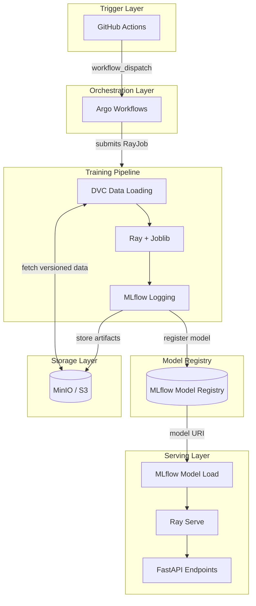
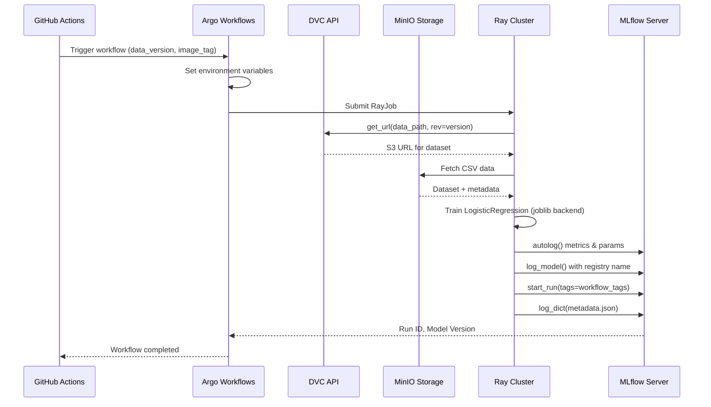
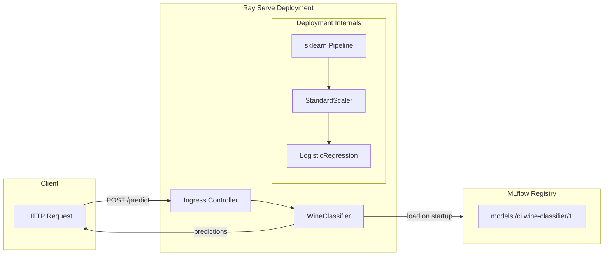

<a id="readme-top"></a>

<!-- PROJECT LOGO & TITLE -->

<div align="center">
  <a href="https://github.com/opencloudhub">
  <picture>
    <source media="(prefers-color-scheme: light)" srcset="https://raw.githubusercontent.com/opencloudhub/.github/main/assets/brand/assets/logos/primary-logo-light.svg">
    <source media="(prefers-color-scheme: dark)" srcset="https://raw.githubusercontent.com/opencloudhub/.github/main/assets/brand/assets/logos/primary-logo-dark.svg">
    <!-- Fallback -->
    
  </picture>
  </a>

<h1 align="center">Wine Classifier — MLOps Baseline Demo</h1>

<p align="center">
    End-to-end MLOps pipeline demonstrating core platform patterns with scikit-learn, MLflow experiment tracking, DVC data versioning, and Ray Serve deployment.<br />
    <a href="https://github.com/opencloudhub"><strong>Explore OpenCloudHub »</strong></a>
  </p>
</div>

______________________________________________________________________

<details>
  <summary>📑 Table of Contents</summary>
  <ol>
    <li><a href="#about">About</a></li>
    <li><a href="#thesis-context">Thesis Context</a></li>
    <li><a href="#architecture">Architecture</a></li>
    <li><a href="#code-structure">Code Structure</a></li>
    <li><a href="#getting-started">Getting Started</a></li>
    <li><a href="#infrastructure">Infrastructure Options</a></li>
    <li><a href="#usage">Usage</a></li>
    <li><a href="#configuration">Configuration</a></li>
    <li><a href="#workflow-tags">Workflow Tags & Traceability</a></li>
    <li><a href="#contributing">Contributing</a></li>
    <li><a href="#license">License</a></li>
  </ol>
</details>

______________________________________________________________________

<h2 id="about">🎯 About</h2>

This repository implements a **baseline MLOps workload** using scikit-learn and the UCI Wine Quality dataset. It serves as the foundational demonstration that validates core platform patterns before introducing complexity through distributed training, hyperparameter optimization, or generative AI workloads.

The pipeline demonstrates:

- **Experiment Tracking** — All training runs captured in MLflow with parameters, metrics, and artifacts
- **Data Versioning** — Reproducible datasets via DVC with S3-compatible storage (MinIO)
- **Model Registry** — Centralized model versioning with lifecycle stage management
- **Production Serving** — Ray Serve with FastAPI providing scalable inference endpoints
- **Full Traceability** — Every model traceable to its exact data version, code commit, and workflow execution

______________________________________________________________________

<h2 id="thesis-context">📚 Thesis Context</h2>

This repository is part of a Master's thesis: **"A Scalable MLOps System for Multimodal Educational Analysis"** at Goethe University Frankfurt / DIPF Leibniz Institute.

### Role in the Platform

This workload serves as the **baseline demonstration** that establishes core integration patterns. By using scikit-learn (the simplest ML framework), it isolates and validates the MLOps infrastructure without the complexity of distributed training or GPU scheduling. All subsequent workloads (PyTorch Lightning, Transformers, Qwen VL) follow the same patterns established here.

### Requirements Addressed

| Req ID   | Requirement               | Implementation                                                                           |
| -------- | ------------------------- | ---------------------------------------------------------------------------------------- |
| **FR1**  | Experiment Tracking       | MLflow `autolog()` captures all sklearn metrics; custom tags link runs to workflows      |
| **FR2**  | Data Versioning           | DVC resolves dataset versions from `data-registry`; metadata logged as MLflow artifact   |
| **FR3**  | Model Registry            | Models registered via `mlflow.sklearn.log_model()` with `registered_model_name`          |
| **FR5**  | Model Serving             | Ray Serve deployment with FastAPI; loads models via `mlflow.sklearn.load_model()`        |
| **FR6**  | Framework Agnosticism     | Validates platform supports traditional ML (sklearn) alongside deep learning             |
| **FR14** | GitOps Deployment         | RayService manifests in `gitops` repo synced by ArgoCD                                   |
| **FR15** | CI/CD Integration         | GitHub Actions triggers Argo Workflows for automated training                            |
| **NFR1** | End-to-End Lineage        | Workflow tags (`argo_workflow_uid`, `docker_image_tag`, `dvc_data_version`) on every run |
| **NFR2** | Reproducibility           | DVC version + environment configuration ensures reproducible training                    |
| **NFR8** | Declarative Configuration | Pydantic Settings for typed, validated configuration                                     |
| **C1**   | Open-Source Only          | sklearn, MLflow, Ray, DVC — all Apache 2.0 or similar licenses                           |
| **C2**   | Self-Hostable             | Runs entirely on self-hosted Kubernetes with MinIO storage                               |

### Integration Patterns Demonstrated

This workload establishes patterns that all other ML workloads follow:

```
┌─────────────────┐     ┌─────────────────┐     ┌─────────────────┐
│  data-registry  │────▶│  ai-ml-sklearn  │────▶│     gitops      │
│  (DVC datasets) │     │  (this repo)    │     │  (deployment)   │
└─────────────────┘     └─────────────────┘     └─────────────────┘
        │                       │                       │
        ▼                       ▼                       ▼
   Versioned data         Model artifact          RayService
   in MinIO               in MLflow Registry      manifest synced
```

### Related Components

| Component                | Repository                                                     | Relationship                         |
| ------------------------ | -------------------------------------------------------------- | ------------------------------------ |
| **Data Source**          | [data-registry](https://github.com/opencloudhub/data-registry) | DVC-versioned wine-quality dataset   |
| **Workflow Templates**   | [gitops](https://github.com/opencloudhub/gitops)               | Argo Workflow templates for training |
| **Deployment Manifests** | [gitops](https://github.com/opencloudhub/gitops)               | RayService YAML for model serving    |
| **CI/CD Actions**        | [.github](https://github.com/opencloudhub/.github)             | Reusable workflows for Docker builds |

______________________________________________________________________

<h2 id="architecture">🏗️ Architecture</h2>

### End-to-End Pipeline



### Training Flow Detail



### Serving Architecture



______________________________________________________________________

<h2 id="code-structure">📂 Code Structure</h2>

Each file includes detailed header comments explaining its purpose, dependencies, and usage. This section provides an overview of the codebase organization.

### Project Layout

```
ai-ml-sklearn/
├── src/
│   ├── training/                   # Training pipeline
│   │   ├── train.py                # Entrypoint: orchestrates training flow
│   │   ├── data.py                 # DVC data loading from S3/MinIO
│   │   └── config.py               # Pydantic configuration models
│   ├── serving/                    # Model serving
│   │   ├── serve.py                # Ray Serve deployment with FastAPI
│   │   ├── schemas.py              # Request/response Pydantic models
│   │   └── config.py               # Serving configuration
│   └── _utils/
│       └── logging.py              # Rich logging with Ray compatibility
├── tests/
│   └── test_wine_classifier.py     # API integration tests
├── .github/workflows/
│   ├── ci-code-quality.yaml        # Pre-commit, ruff, type checking
│   ├── ci-docker-build-push.yaml   # Multi-stage Docker builds
│   └── train.yaml                  # MLOps pipeline trigger
├── Dockerfile                      # Multi-stage: dev → training → serving
├── .env.docker                     # Local compose environment
├── .env.minikube                   # Minikube environment
└── pyproject.toml                  # UV package configuration
```

### Training Module (`src/training/`)

#### `train.py` — Training Entrypoint

The main training script orchestrates the complete training pipeline:

```python
# Key responsibilities:
# 1. Parse CLI arguments (--C, --max-iter, --solver)
# 2. Load versioned data via DVC
# 3. Initialize Ray with joblib backend for distributed fitting
# 4. Train sklearn Pipeline (StandardScaler → LogisticRegression)
# 5. Log everything to MLflow (autolog + custom tags + artifacts)
# 6. Register model in MLflow Model Registry
```

**MLflow Integration:**

- `mlflow.sklearn.autolog()` — Automatically captures parameters, metrics, and model signature
- `mlflow.start_run(tags=...)` — Passes workflow traceability tags (argo_workflow_uid, docker_image_tag, dvc_data_version) at run creation
- `mlflow.log_dict()` — Stores DVC metadata as JSON artifact for data provenance
- `mlflow.sklearn.log_model(..., registered_model_name=...)` — Registers model in registry

**Ray Integration:**

- `ray.init()` — Connects to Ray cluster (local or remote)
- `register_ray()` — Enables joblib to use Ray as backend
- `with joblib.parallel_backend("ray"):` — Distributes sklearn's internal parallelism

#### `data.py` — DVC Data Loading

Handles fetching versioned datasets from the data registry:

```python
# Data flow:
# 1. dvc.api.get_url() → Resolves version tag to S3 path
# 2. dvc.api.read() → Fetches metadata.json (feature stats, dataset info)
# 3. s3fs.S3FileSystem → Opens CSV file from MinIO
# 4. train_test_split() → Creates train/validation sets
# 5. Returns (X_train, y_train, X_val, y_val, metadata)
```

**Why DVC API instead of `dvc pull`:**

- No local DVC cache needed in containers
- Direct S3 access is faster for single files
- Version resolution happens at runtime, not build time

#### `config.py` — Configuration Management

Pydantic Settings models for typed, validated configuration:

```python
# Two configuration classes:
#
# TRAINING_CONFIG (TrainingConfig) — singleton, always available:
#   - mlflow_experiment_name: str
#   - mlflow_registered_model_name: str
#   - dvc_repo: str (data-registry URL)
#   - dvc_data_path: str (path within repo)
#   - random_state: int
#
# get_workflow_tags() → WorkflowTags — lazy-loaded to avoid import errors:
#   - argo_workflow_uid: str (from ARGO_WORKFLOW_UID env)
#   - docker_image_tag: str (from DOCKER_IMAGE_TAG env)
#   - dvc_data_version: str (from DVC_DATA_VERSION env)
```

### Serving Module (`src/serving/`)

#### `serve.py` — Ray Serve Deployment

Production-ready model serving with FastAPI integration:

```python
# Key components:
#
# app_builder(args: AppBuilderArgs) → Application
#   - Factory function for Ray Serve
#   - Receives model_uri from deployment config
#   - Returns bound FastAPI application
#
# WineClassifier:
#   - __init__(): Loads model via mlflow.sklearn.load_model()
#   - _load_model(): Internal method to load and extract metadata
#   - reconfigure(): Hot-reload models without restart
#   - Extracts run metadata for /info endpoint
#
# FastAPI routes:
#   - GET /        → Service info
#   - GET /health  → Liveness probe
#   - GET /info    → Model metadata (URI, run_id, data_version)
#   - POST /predict → Batch predictions
```

**Hot Reload Pattern:**

```python
# Ray Serve's reconfigure() enables zero-downtime model updates:
def reconfigure(self, config: dict) -> None:
    new_model_uri = config.get("model_uri")
    if not new_model_uri:
        return
    if self.model_info is None or self.model_info.model_uri != new_model_uri:
        self._load_model(new_model_uri)  # Reloads model and updates metadata
```

#### `schemas.py` — API Contracts

Pydantic models defining the REST API interface:

```python
# PredictionRequest: Batch input with validation
#   - features: List[List[float]] — each inner list has 12 values
#   - Validates feature count, checks for NaN/infinite values
#   - Max batch size from SERVING_CONFIG.request_max_length
#
# PredictionResponse: Batch of predictions
#   - predictions: List[Prediction] (quality_score + confidence)
#   - model_uri: str
#   - timestamp: datetime
#   - processing_time_ms: float
#
# Additional models: HealthResponse, ModelInfo, RootResponse, ErrorResponse
```

### CI/CD Workflows (`.github/workflows/`)

#### `train.yaml` — MLOps Pipeline Trigger

```yaml
# Workflow dispatch inputs:
#   - dvc_data_version: Dataset version tag (default: 'latest')
#   - training_entrypoint: Script to run (default: 'python src/training/train.py')
#   - training_args: Additional CLI args (e.g., '--C 0.9 --max-iter 90')
#   - training_image_tag / serving_image_tag: Docker image versions
#   - compute_type: Resource config (cpu-small, cpu-medium, cpu-large, etc.)
#   - approval_mode: 'manual' or 'automatic' model promotion
#   - comparison_metric / comparison_threshold: Model comparison settings
#
# Flow:
#   1. Calls reusable workflow from .github repo
#   2. Resolves Docker image tags
#   3. Submits Argo Workflow with parameters
#   4. Argo runs training job on Kubernetes
```

#### `ci-docker-build-push.yaml` — Container Builds

```yaml
# Multi-stage build targets:
#   - training: Includes training dependencies + Ray
#   - serving: Minimal image with serving deps only
#
# Tagging strategy:
#   - SHA tag: ghcr.io/opencloudhub/ai-ml-sklearn-training:<sha>
#   - latest: Points to most recent main branch build
```

______________________________________________________________________

<h2 id="getting-started">🚀 Getting Started</h2>

### Prerequisites

- Docker
- VS Code with DevContainers extension (recommended)

### Setup

1. **Clone the repository**

   ```bash
   git clone https://github.com/opencloudhub/ai-ml-sklearn.git
   cd ai-ml-sklearn
   ```

1. **Open in DevContainer** (Recommended)

   VSCode: `Ctrl+Shift+P` → `Dev Containers: Rebuild and Reopen in Container`

   Or **setup locally**:

   ```bash
   curl -LsSf https://astral.sh/uv/install.sh | sh
   uv sync --dev
   ```

1. **Choose infrastructure backend** (see next section)

______________________________________________________________________

<h2 id="infrastructure">🛠️ Infrastructure Options</h2>

This project supports three deployment modes depending on your development stage:

### Option 1: Local Compose Stack

For quick iterations without Kubernetes overhead. Provides MLflow and MinIO via Docker Compose.

```bash
# Start MLflow + MinIO
git clone https://github.com/OpenCloudHub/local-compose-stack.git
cd local-compose-stack && docker compose up -d

# Configure and run
cd ../ai-ml-sklearn
set -a && source .env.docker && set +a
ray start --head
```

**Available Services:**

| Service       | URL                   |
| ------------- | --------------------- |
| MLflow UI     | http://localhost:5000 |
| MinIO Console | http://localhost:9001 |
| MinIO API     | http://localhost:9000 |

### Option 2: Local Development with Minikube Backend

Run training scripts locally while using platform services (MLflow, MinIO) deployed on Minikube. Useful for testing integration with the full platform stack without submitting jobs to the cluster.

```bash
set -a && source .env.minikube && set +a
ray start --head

# Run training locally against Minikube services
python src/training/train.py --C 0.9
```

Requires the OpenCloudHub platform deployed via the [gitops](https://github.com/opencloudhub/gitops) repository.

### Option 3: Full Cluster Execution

Training and serving run entirely on Kubernetes, triggered via CI/CD. This is the production pattern where GitHub Actions submits Argo Workflows to the cluster.

**Trigger training:** [Actions → MLOps Pipeline](https://github.com/OpenCloudHub/ai-ml-sklearn/actions/workflows/train.yaml)

**Flow:** GitHub Actions → Argo Workflows → RayJob (training) → MLflow Registry → RayService (serving)

______________________________________________________________________

<h2 id="usage">📖 Usage</h2>

### Training

```bash
# Basic training
python src/training/train.py --C 0.9 --max-iter 200

# Via Ray Job API (production-like)
RAY_ADDRESS='http://127.0.0.1:8265' ray job submit --working-dir . -- \
    python src/training/train.py --C 0.9
```

**CLI Arguments:**

| Argument     | Default | Description                       |
| ------------ | ------- | --------------------------------- |
| `--C`        | `1.0`   | Regularization strength (inverse) |
| `--max-iter` | `100`   | Maximum solver iterations         |
| `--solver`   | `lbfgs` | Optimization algorithm            |
| `--run-name` | auto    | Custom MLflow run name            |

> **Note:** Dataset version is set via the `DVC_DATA_VERSION` environment variable, not a CLI argument.

### Serving

```bash
# Development with hot-reload
serve run src.serving.serve:app_builder model_uri="models:/ci.wine-classifier/1" --reload

# Access API docs
open http://localhost:8000/docs
```

**Endpoints:**

| Endpoint   | Method | Description                                |
| ---------- | ------ | ------------------------------------------ |
| `/`        | GET    | Service info                               |
| `/health`  | GET    | Liveness probe                             |
| `/info`    | GET    | Model metadata (URI, run_id, data_version) |
| `/predict` | POST   | Batch predictions                          |

______________________________________________________________________

<h2 id="configuration">⚙️ Configuration</h2>

### Required Environment Variables

| Variable                | Description                | Local Value             |
| ----------------------- | -------------------------- | ----------------------- |
| `MLFLOW_TRACKING_URI`   | MLflow server URL          | `http://localhost:5000` |
| `ARGO_WORKFLOW_UID`     | Workflow identifier        | `DEV`                   |
| `DOCKER_IMAGE_TAG`      | Image tag for traceability | `DEV`                   |
| `DVC_DATA_VERSION`      | Dataset version            | `wine-quality-v1.0.0`   |
| `AWS_ACCESS_KEY_ID`     | MinIO access key           | from `.env.*`           |
| `AWS_SECRET_ACCESS_KEY` | MinIO secret               | from `.env.*`           |
| `AWS_ENDPOINT_URL`      | MinIO endpoint             | `http://localhost:9000` |

### Configuration Files

- **`.env.docker`** — Local compose stack settings
- **`.env.minikube`** — Minikube/Kubernetes settings
- **`src/training/config.py`** — Training defaults (experiment name, model name, DVC paths)
- **`src/serving/config.py`** — Serving limits (max batch size, feature count)

______________________________________________________________________

<h2 id="workflow-tags">🏷️ Workflow Tags & Traceability</h2>

Every training run is tagged with three identifiers that enable complete traceability:

| Tag                 | Source                  | Purpose                           |
| ------------------- | ----------------------- | --------------------------------- |
| `argo_workflow_uid` | `ARGO_WORKFLOW_UID` env | Links to Argo Workflows execution |
| `docker_image_tag`  | `DOCKER_IMAGE_TAG` env  | Identifies exact code version     |
| `dvc_data_version`  | `DVC_DATA_VERSION` env  | Identifies exact dataset version  |

**Traceability Chain:**

```
MLflow Run
    ├── argo_workflow_uid ──────► Argo Workflows UI (logs, DAG)
    ├── docker_image_tag ───────► Container Registry (Dockerfile, code)
    ├── dvc_data_version ───────► data-registry Git tag (dataset)
    └── artifacts/metadata.json ► Dataset statistics, provenance
```

**Local Development:** Set workflow tags to `"DEV"` except `DVC_DATA_VERSION` which should point to a real dataset version.

______________________________________________________________________

<h2 id="contributing">👥 Contributing</h2>

Contributions welcome! See [Contributing Guidelines](https://github.com/opencloudhub/.github/blob/main/.github/CONTRIBUTING.md) and [Code of Conduct](https://github.com/opencloudhub/.github/blob/main/.github/CODE_OF_CONDUCT.md).

______________________________________________________________________

<h2 id="license">📄 License</h2>

Apache 2.0 License. See [LICENSE](LICENSE).

______________________________________________________________________

<h2 id="acknowledgements">🙏 Acknowledgements</h2>

- [UCI Wine Quality Dataset](https://archive.ics.uci.edu/ml/datasets/wine+quality)
- [MLflow](https://mlflow.org/) — Experiment tracking and model registry
- [Ray](https://ray.io/) — Distributed computing and serving
- [DVC](https://dvc.org/) — Data version control
- [FastAPI](https://fastapi.tiangolo.com/) — REST API framework

<p align="right">(<a href="#readme-top">back to top</a>)</p>
